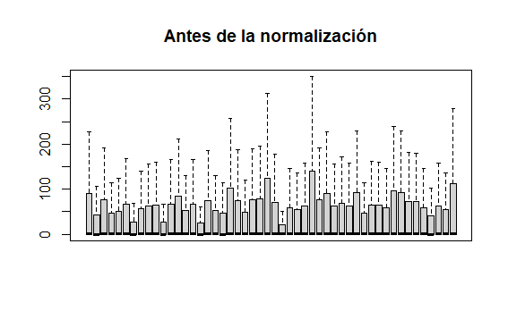
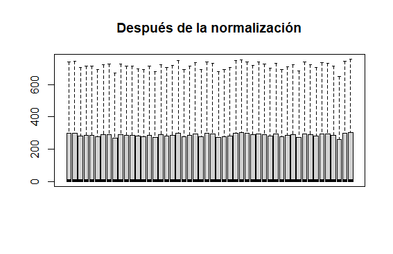
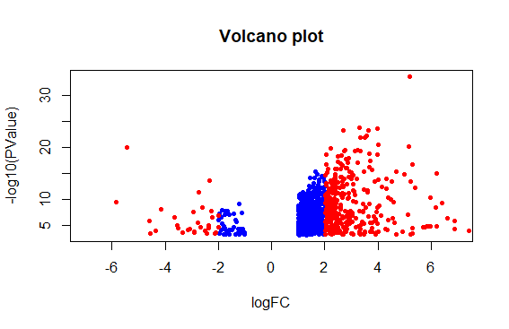
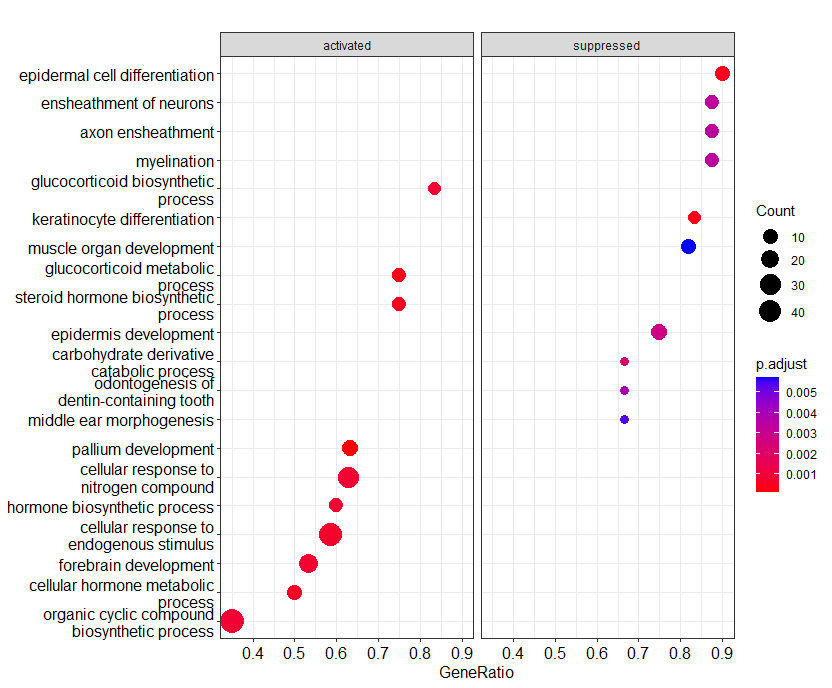
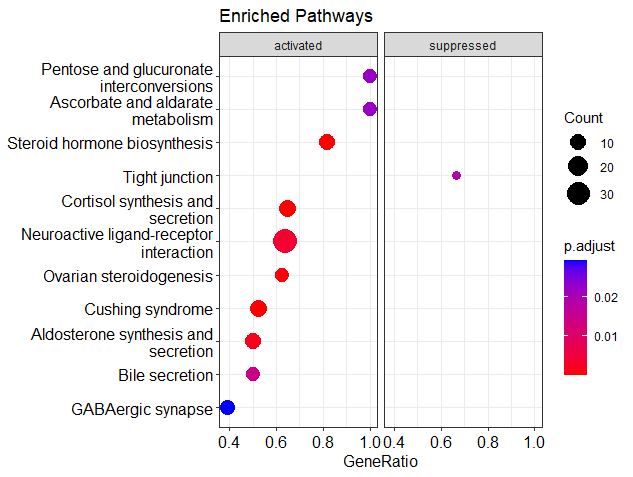

# Finding differential genes that may be involved in the overall survival of pancreatic cancer patients

The Genomic Data Commons (GDC) is a portal that contains a lot of projects related to cancer diseases. The GDC has transcriptomic, proteomic, genomic, and metabolomic data from Cancer patients. Here, I developed a pipeline to analyze a pancreatic cancer project.  [Oficcial GDC page: ](https://portal.gdc.cancer.gov/)  

The R program has a library named "TCGA_biolinks" with free access to GDC data. 

### About the project

Here, I use the TCGA-PADD project. This project has 185 cases (patients) with a total of 19,556 genes. We have different metadata available. We are going to focus only on dead and live patients. We are conducting a Differential Expression Analysis of pancreatic cancer to find differential dead and live genes.

First, I introduced the project (ductal pancreatic cancer subtype) and downloaded the data to create a counts data frame that we will use for the Differential Analysis Expression. Then, I perform an Enrichment Analysis over the principal DEG genes.

## Methods 


**1. Downloading data**
   
TCGA-bio links have their codes and structure. Here, I combined edgeR and limma to perform a DEG analysis.
We downloaded the data with query.raw. 

The function query.raw has different options as data.category, data.type, and worflow.type (counts data).  We choose "Transcriptome Profiling", but this project has different data.category such as: "Simple Nucleotide Variation", "mi RNA profile", and more. To consult the available data: ([https://portal.gdc.cancer.gov/projects/TCGA-PAAD]) . Data.Type is the quantification form. workflow.type has the available software counts data. 


 ``` R
#Project Name
project <- "TCGA-PAAD"

#Category
Category <- "Transcriptome Profiling"

#We choose the STAR counts 
query.raw <- GDCquery(project = project,
                      data.category = category,
                      data.type = "Gene Expression Quantification",
                      workflow.type = "STAR - Counts"
)

# We download all the data 
GDCdownload(query.raw)

# We organize the data and save it in the RAM memory 
SKCM.counts <- GDCprepare(query = query.raw,
                          summarizedExperiment = TRUE)

#Detele it from the RAM 
rm(query.raw)
 ```

Next, we create the count's data frame with the assay() function. 

 ``` R
# We generate the Expression Matrix (TPM counts)
data2<-assay(SKCM.counts)

#save the data frame
write.table(data2, "conteos_TCGA.csv")

#Save the R data session
save(data2, SKCM.counts, file="conteos.RData")

 ```

**2. Pre-process**

In these steps, we eliminate outliers and perform the data normalization.  

First, we use the TCGAanalyze_Preprocessing() function to find outliers. Then, with the TCGAanalyze_Normalization() normalized the data (samples) and observed the different distribution with boxplots. Finally, TCGAanalyze_Filtering() filter genes, and with tmm() we applied the TMM normalization.

We use TMM normalization. 

``` R

# 
# 1- Function TCGAanalyze_Preprocessing
dataPrep<-TCGAanalyze_Preprocessing(object=SKCM.counts,
                                    cor.cut = 0.6
                                    )

#No outliers !! 

# 2- Function TCGAanalyze_Normalization
dataNorm<-TCGAanalyze_Normalization(tabDF=data2,
                                    geneInfo = TCGAbiolinks::geneInfoHT,
                                    method="gcContent")


#Revisamos que todo vaya bien con la normalizacion y metodo

boxplot(data2[,1:50], outline=FALSE, main="Antes de la normalización", xaxt="n")
boxplot(dataTMMnorm[,1:50], outline=FALSE, main="Después de la normalización", xaxt="n")

# 3- Function TCGAanalyze_Filtering 

dataFilt<-TCGAanalyze_Filtering(tabDF=dataNorm,
                                method="quantile", 
                                qnt.cut = 0.25)

# 4- Normalized Method -- >  TMM
dataTMMnorm<- tmm(dataFilt)

#We save the normalized data frame 
write.table(dataTMMnorm, "Tabla_Normalizada.csv")

#Save the project
save(dataPrep, dataNorm, dataFilt, dataTMMnorm, file="Preprocesamiento.RData")
```






**3.DEG**

First, we need to verify the available metadata. then, we choose the Dead and Alive projects. 

``` R

#1 We see the metadata 
sample.info<-colData(SKCM.counts)
print(sample.info)
head(sample.info)

#We need the Dead and Alive patients. 
Dead.data <-dataTMMnorm[,which(sample.info@listData[["paper_Follow up vital status"]]=="Dead")]

Alive.data <-dataTMMnorm[,which(sample.info@listData[["paper_Follow up vital status"]]=="Alive")]

#Save the R session
save(Dead.data, Alive.data, file="Conditions.RData")

```
Now we have the samples and we can perform the DEG with the condition (DEAD over ALIVE patients). The function is TCGAanalyze_DEA()

``` R
load("Conditions.RData")

#Perform DEG
dataDEGs <- TCGAanalyze_DEA(mat1 = Dead.data,
                            mat2 = Alive.data,
                            Cond1type = "Dead",
                            Cond2type = "Alive",
                            fdr.cut = 0.01 ,  #False Discovery Rate
                            logFC.cut = 1,   #Fold Change
                            method = "glmLRT") 


# 79 samples in Cond1type Dead
# 71 samples in Cond2type Alive
# 45,362 features as miRNA or genes

summary(dataDEGs)

``` 

By defect, we have miRNA, mRNA, and other transcriptomic data. We are going to separate the protein-coding genes because we want to perform an enrichment analysis.

``` R
#Coding genes
DEG <- filter(dataDEGs, gene_type=="protein_coding")

#861 coding genes 

#save the data frames

write.table(dataDEGs, "Genes_Diferenciados_TCGA.csv",
            row.names=T)
write.table(DEG, "Genes_Dif_ProteinCoding.csv",
            row.names=T)

#save the session
save(DEG, dataDEGs, file="DEG.RData")

summary(DEG)

``` 
Let's see the DEG results with a volcano plot 

``` R
######################   Volcano plot and heatmap ##############

### A Basic volcano plot
par(mfrow=c(1,1))

# volcano plot
with(DEG, plot(logFC, -log10(PValue), pch=20, main="Volcano plot", xlim=c(-7,7)))

#We select these values, but it is important to adjust these values according to your data and perform an analysis of the values #beforehand.

# blue padj<0.1, red si log2FC>1 y padj<0.1)
with(subset(DEG, PValue<0.05 ), points(logFC, -log10(PValue), pch=20, col="blue"))
with(subset(DEG, PValue<0.05 & abs(logFC)>2), 
     points(logFC, -log10(PValue), pch=20, col="red"))
  
```



## Enrichment Analysis 

Now, we will perform an Enrichment Analysis. First and foremost, we will make the GO function and graphs 

``` R
#1. Coding genes

DegGenes <- dataDEGs[dataDEGs$gene_type == "protein_coding", ]

#libraries

library(clusterProfiler)
library(org.Hs.eg.db)
library (DOSE)
library(GSEABase)
library(pathview)
library(enrichplot)
library(ggridges)


# We need to select the LogFC genes 
original_gene_list <- DegGenes$logFC

# Now, the genes list
names(original_gene_list) <- DegGenes$gene_name

# We omit NA values 
gene_list<-na.omit(original_gene_list)

# We sort the list in descending order (requirement for clusterProfiler package)

gene_list = sort(gene_list, decreasing = TRUE)
print(gene_list)

#3. Let's make the GSEA 

#Humans package
keytypes(org.Hs.eg.db)

# GSEA Parameters
gse <- gseGO(geneList=gene_list, 
             ont ="ALL", #We want CC, FM, MM 
             keyType = "SYMBOL", #ID type of the Genes
             nPerm = 10000, #Permutation number
             minGSSize = 3, #Minimium genes 
             maxGSSize = 200, #Max number of genes
             pvalueCutoff = 0.05, #Cut 
             verbose = TRUE, #Print the process
             OrgDb = "org.Hs.eg.db", #Organism
             pAdjustMethod = "none") #Ajust method

#283 GO Terms

#Save the results

enrichment <- as.data.frame(gse)
write.table(enrichment, "tabla_enriquecimiento.csv")


#4. We built graphics

head(gse)

dotplot(gse, showCategory=10, split=".sign") + facet_grid(.~.sign)

#(see the code attached for more)

```


## KEGG Terms

``` R


# KEGG ####

#Convert ID to Entrez
ids<-bitr(names(original_gene_list), fromType = "SYMBOL", toType = "ENTREZID", 
          OrgDb="org.Hs.eg.db")

head(gene_list)

#Delete duplicates 
dedup_ids = ids[!duplicated(ids[c("ENTREZID")]),]

#Data frame 
df2 = DegGenes[DegGenes$gene_name %in% dedup_ids$SYMBOL,]

# Columns names with ID's 
colnames(df2)[colnames(df2) == "gene_name"] <- "SYMBOL"

df2 <- merge(dedup_ids, df2, by="SYMBOL")

# Choose fold change
kegg_gene_list <- df2$logFC

#Name KEGG with IDs
names(kegg_gene_list) <- df2$ENTREZID

#Omit NA values
kegg_gene_list<-na.omit(kegg_gene_list)

#Sort genes 
kegg_gene_list = sort(kegg_gene_list, decreasing = TRUE)

print(kegg_gene_list)

### KEGG Analysis 
kk2 <- gseKEGG(geneList     = kegg_gene_list,
               organism     = "hsa",
               nPerm        = 10000,
               minGSSize    = 3,
               maxGSSize    = 800,
               pvalueCutoff = 0.05,
               pAdjustMethod = "none",
               keyType       = "ncbi-geneid")

KEGG <- as.data.frame(kk2)

write.table(KEGG, "KEGG_Table.csv")

#Graphic
dotplot(kk2, showCategory = 10, title = "Enriched Pathways" , split=".sign") + 
  facet_grid(.~.sign)

```




## Acknowledgment

Tere Parra (2022).  GitHub. [https://github.com/Tere-Parra/Finding-genes-that-may-be-involved-in-pancreatic-cancer-patient-survival.git]

## REFERENCES

Colaprico, Antonio, et al. “TCGAbiolinks: an R/Bioconductor package for integrative analysis of TCGA data.” Nucleic acids research 44.8 (2015): e71-e71.

Silva, Tiago C., et al. “TCGA Workflow: Analyze cancer genomics and epigenomics data using Bioconductor packages.” F1000Research 5 (2016). (https://f1000research.com/articles/5-1542/v2)

Mounir, Mohamed, et al. “New functionalities in the TCGAbiolinks package for the study and integration of cancer data from GDC and GTEx.” PLoS computational biology 15.3 (2019): e1006701. (https://doi.org/10.1371/journal.pcbi.1006701)
Other useful links

Carmona Pedo & Cano Carlos, Analisis bioinformatico para un problems de ómicas. Google Colaboratory. (2019). Google.com. https://colab.research.google.com/drive/1sgkBRHqzUOxUHh4j_li3daHWqyNjEDOk?usp=sharing#scrollTo=Oe0PL76cRV23

‌


